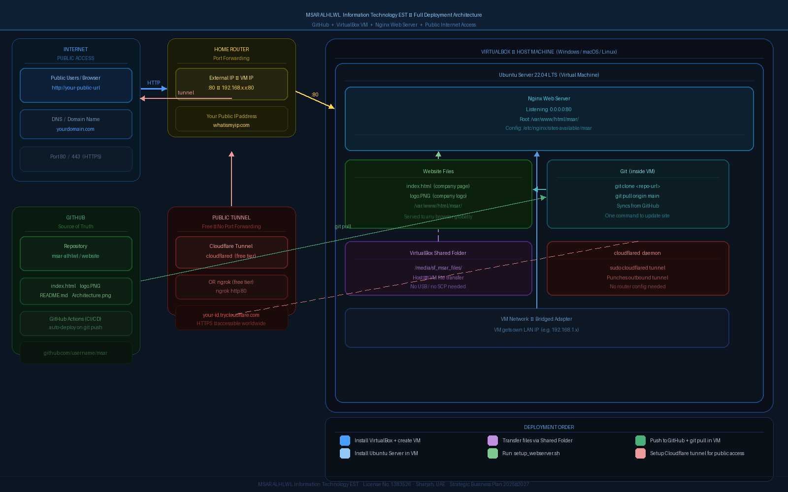

# MSAR ALHLWL — Information Technology EST

> **مؤسسة مسار الحلول لتقنية المعلومات** — Path of Solutions



## 🏢 About

**MSAR ALHLWL Information Technology EST** is a Sharjah-based IT establishment specializing in cloud infrastructure, DevOps services, and digital transformation for UAE SMEs.

- 📍 Office 901, B49, Business Bay, Sharjah, UAE
- 📋 License No. **1383526** — Dept. of Economic Development, Sharjah
- 📞 +971-50-6521841
- ✉️ m0h2med.abdalla@gmail.com

---

## 🚀 Project: Self-Hosted Company Website

This repository contains the company website deployed on a **VirtualBox Ubuntu VM** with **Nginx**, publicly accessible via **Cloudflare Tunnel**.

### Architecture

| Component | Technology |
|-----------|-----------|
| Hosting | VirtualBox VM — Ubuntu Server 22.04 LTS |
| Web Server | Nginx |
| Public Access | Cloudflare Tunnel (free) |
| Source Control | GitHub (this repo) |
| Deployment | `git pull` + `msar-update` script |

---

## 📦 Files

```
/
├── index.html          # Company website (all info, services, contacts)
├── logo.PNG            # Company logo
├── architecture.png    # Deployment architecture diagram
├── setup_webserver.sh  # One-command VM setup script
└── README.md           # This file
```

---

## ⚙️ Deployment Guide

### Prerequisites
- VirtualBox installed on host
- Ubuntu Server 22.04 ISO
- This repository

### Step 1 — Clone repo inside the VM
```bash
git clone https://github.com/YOUR_USERNAME/msar-website.git /opt/msar-website
```

### Step 2 — Run setup script
```bash
cd /opt/msar-website
chmod +x setup_webserver.sh
sudo ./setup_webserver.sh https://github.com/YOUR_USERNAME/msar-website.git
```

### Step 3 — Make it public
```bash
cloudflared tunnel --url http://localhost:80
```
Copy the `https://xxxx.trycloudflare.com` URL — that's your public website!

### Step 4 — Update after pushing to GitHub
```bash
sudo msar-update
```

---

## 🔄 Update Workflow

```
Edit files locally
      ↓
git add . && git commit -m "update"
      ↓
git push origin main
      ↓
Inside VM: sudo msar-update
      ↓
Site updated live ✅
```

---

## 🌐 Services Offered

- ☁️ Cloud Infrastructure (AWS, Azure, GCP)
- ⚙️ DevOps & Automation (CI/CD, Docker, Kubernetes)
- 🌐 Web Design & Development
- 🔌 IT Network Services
- 🛡️ Managed Services (24/7 monitoring)

---

## 📄 License

© 2024–2026 MSAR ALHLWL Information Technology EST. All rights reserved.
License No. 1383526 — Sharjah Department of Economic Development.
